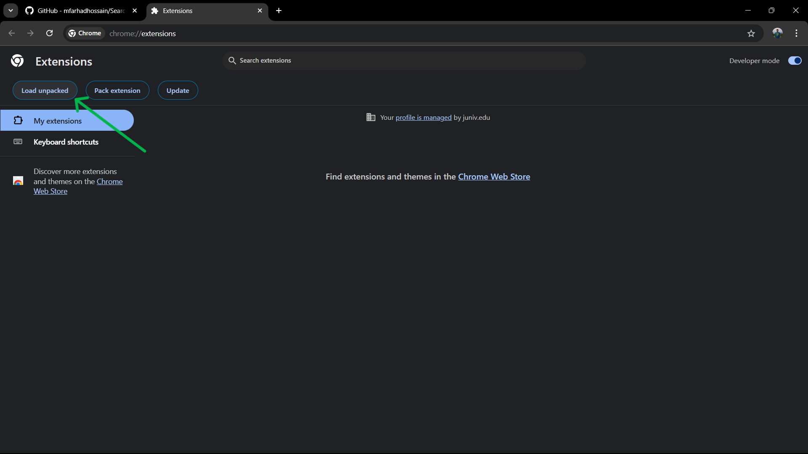
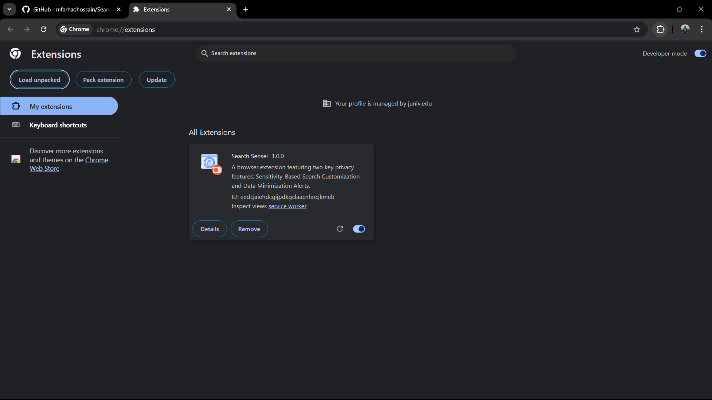

# SearchSensei: Featuring Sensitivity-Based Search Customization and Data Minimization Alerts

## SearchSensei is a Chrome extension that helps you protect sensitive information in your search queries. It provides options to customize your search input to limit data sharing and alerts you to unnecessary data collection practices.

## Installation Options

There are two ways to install SearchSensei:

1.  **For Testing Only (No Development Setup Required)**

    If you want to test the extension without setting up a development environment:

    - **Download/Collect the `dist` Folder**:

      - Obtain the `dist` folder from the developer. This folder is pre-built and does not require installation of Node.js or other development tools.

    - **Load the Extension in Chrome**:
      1. Open Chrome and go to `chrome://extensions/`. 
      2. Enable **Developer mode** using the toggle in the upper-right corner. 
      3. Click **Load unpacked** and navigate to the `dist` folder you obtained.
      
      4. Select the `dist` folder, and the extension should appear in your Chrome extensions list.
      

   - **For an In-Depth User Guide**:
     - To learn more about using SearchSensei’s features, visit the [User Guide](USER_GUIDE.md).

2.  **For Development and Customization** (requires Node.js, Git, and other prerequisites):
    - Clone the repository, set up the development environment, and build the extension yourself by following the steps below.

---

## Installation and Setup (For Development)

## Prerequisites

Before you begin, make sure you have the following installed:

1. **Node.js**: Required to run npm commands.
   - [Download and install Node.js](https://nodejs.org/).
2. **Git**: Required to clone the repository.
   - [Download and install Git](https://git-scm.com/).
3. **Visual Studio Code (VS Code)**: Recommended for editing and managing the project.
   - [Download and install VS Code](https://code.visualstudio.com/).

## Getting Started

### Step 1: Clone the Repository Using VS Code

You can use Visual Studio Code to clone the repository easily.

1. **Open VS Code**.
2. **Open the Command Palette**:
   - On Windows/Linux: Press `Ctrl+Shift+P`.
   - On macOS: Press `Cmd+Shift+P`.
3. **Run "Git: Clone" Command**:
   - In the Command Palette, type `Git: Clone` and select it.
4. **Enter Repository URL**:
   - When prompted, paste the repository URL:
     ```
     https://github.com/mfarhadhossain/SearchSensei.git
     ```
5. **Select Local Folder**:
   - Choose the local directory where you want to clone the repository.
6. **Open the Cloned Repository**:
   - When prompted to open the cloned repository, click **Open**.

### Step 2: Install Required Packages

In VS Code:

1. **Open a Terminal**:
   - Go to `Terminal` > `New Terminal` in the menu bar.
2. **Install Dependencies**:
   - In the terminal, ensure you're in the project directory (you should see the path to `SearchSensei`).
   - Run the following command to install all necessary packages:
     ```bash
     npm install
     ```

### Step 3: Set Up the OpenAI API Key

To use SearchSensei, you need a valid OpenAI API key.

1. **Obtain Your OpenAI API Key**:

   - Sign up or log in to your OpenAI account at [OpenAI's API](https://platform.openai.com/account/api-keys).
   - Generate a new API key.

2. **Update `background.ts`**:

   - In VS Code, open the file `src/background.ts`.
   - Locate the line where the API key is defined:
     ```typescript
     const OPEN_AI_API_KEY = 'your_openai_api_key_here';
     ```
   - Replace `'your_openai_api_key_here'` with your actual OpenAI API key (keep it within the quotes):
     ```typescript
     const OPEN_AI_API_KEY = 'sk-...';
     ```

   **Note**: Be cautious with your API key. Do not share it publicly or commit it to any public repositories.

### Step 4: Build the Extension

You have two options:

- **Development Build**:

  - Run:
    ```bash
    npm start
    ```
  - This starts a development build process that watches for changes and bundles files into the `dist` folder.

- **Production Build**:
  - Run:
    ```bash
    npm run build
    ```
  - This generates a minimized production build in the `dist` folder.

### Step 5: Load the Extension into Chrome

1. **Open Chrome Extensions Page**:

   - Navigate to `chrome://extensions/` in your Chrome browser.

2. **Enable Developer Mode**:

   - Toggle the **Developer mode** switch in the top right corner.

3. **Load Unpacked Extension**:

   - Click on **Load unpacked**.
   - In the dialog that opens, navigate to the `dist` folder inside your `SearchSensei` project directory.
   - Select the `dist` folder and click **Select Folder**.

4. **Verify the Extension is Loaded**:
   - You should now see SearchSensei listed among your Chrome extensions.
5. **Pin the Extension**:
   - Locate the extension icon in Chrome’s toolbar, click the puzzle piece icon (extensions icon 🧩), and pin SearchSensei to ensure easy access.

## Using SearchSensei

**User Guide**

For an in-depth user guide on using SearchSensei’s features, click here to visit the [User Guide](USER_GUIDE.md)

## Important Notes

- **Security**:

  - Your OpenAI API key is sensitive information. Do not share it or commit it to public repositories.
  - The extension uses this API key to make requests to OpenAI's services.

- **Privacy**:
  - SearchSensei is designed to enhance your privacy. Be mindful of the data you share and ensure you trust the sources of any third-party extensions.

## License

SearchSensei is licensed for **personal, non-commercial use only**. Users are not permitted to copy, modify, publish, distribute, sublicense, or sell copies of this software.

For full license terms, see the included [LICENSE](./LICENSE.md) file.

---

Thank you for using SearchSensei to enhance your search privacy! We hope it proves to be both effective and easy to use.
