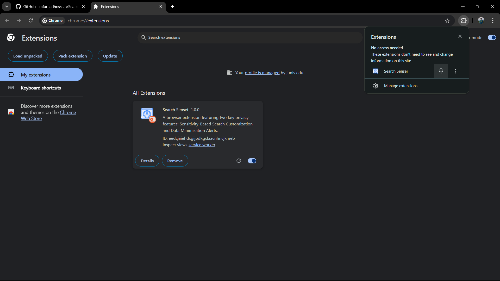
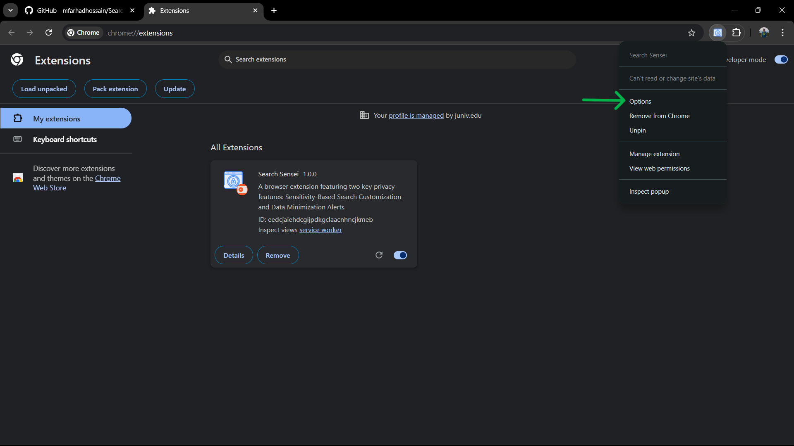
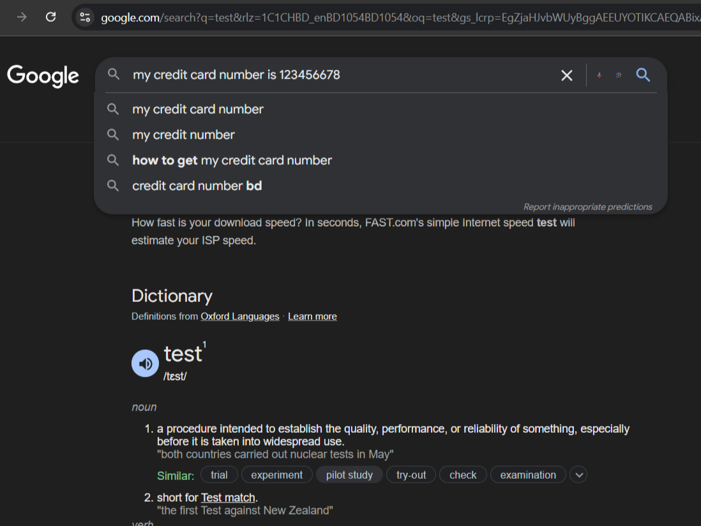
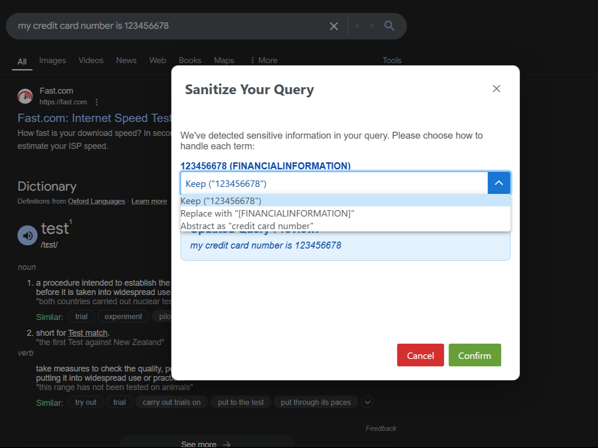
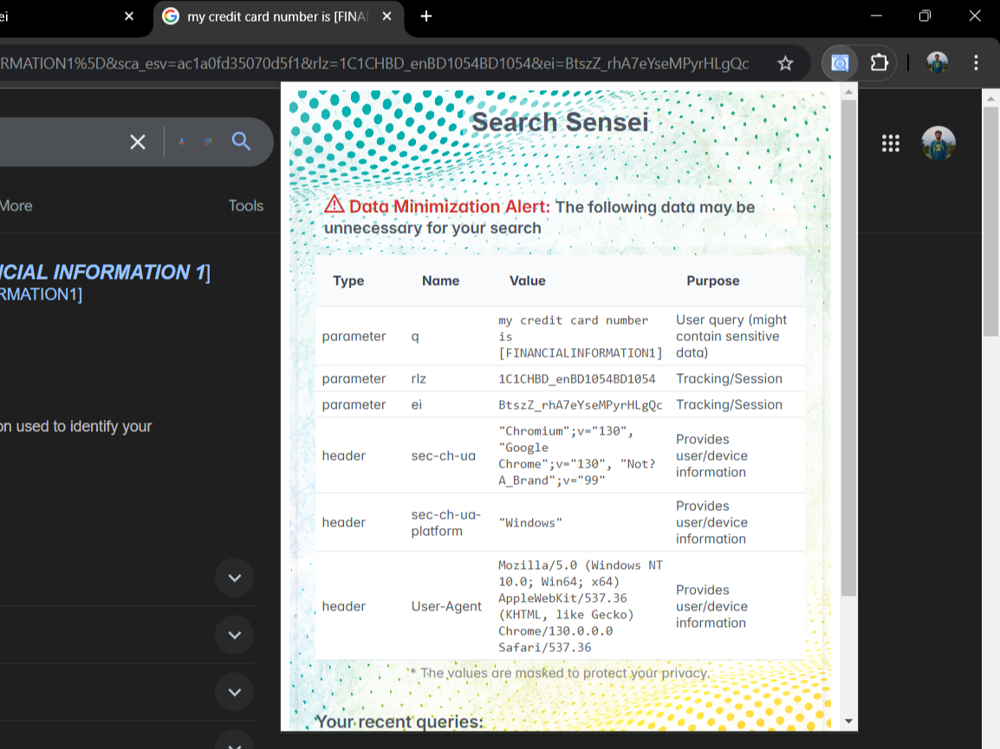

# User Guide for SearchSensei

This guide explains how to use SearchSensei’s features, including configuring preferences, managing data minimization alerts, and sanitizing search queries.

**Note**: To follow along with this guide, the SearchSensei extension needs to be installed. If you have not installed it yet, please refer to the installation instructions in the [README](README.md) file.

## Pinning the Extension

To ensure easy access to SearchSensei, pin the extension to your Chrome toolbar:

1. **Open Chrome** and go to the Extensions menu by clicking the puzzle piece icon 🧩 in the toolbar.
2. Locate **SearchSensei** in the list and click the **pin icon** next to it.

   

Once pinned, the SearchSensei icon will appear in your Chrome toolbar for easy access.

## Accessing the Preferences Page

To configure SearchSensei’s settings:

1. **Right-click** on the SearchSensei icon in the Chrome toolbar.
2. Select **Options** from the context menu.
   

3. This opens the **Preferences page**, where you can enable or disable features based on your needs.

## Preferences Page Options

On the Preferences page, you will find several options to customize your SearchSensei experience.

### Enabling or Disabling Features

- **Query Sanitization**: Toggle this feature to enable sensitivity-based query sanitization. When active, SearchSensei checks for sensitive terms in your query and allows you to adjust the query as needed.
- **Data Minimization Alerts**: When enabled, this feature monitors and alerts you if unnecessary data is being sent along with your query.
- **Show Recent Searches**: Toggle this feature to display recent search queries in the extension’s popup.

Each feature can be independently enabled or disabled.

## Sanitizing Your Query

When SearchSensei detects sensitive information in a search query, it prompts you to review and sanitize it before proceeding.

1. **Sanitization Prompt**: If sensitive terms are detected, a dialog appears with each term highlighted.

   

2. **Choose an Action**:
   - **Keep** the term as-is.
   - **Replace** the term with a placeholder (e.g., `[NAME]`).
   - **Abstract** the term to a general description (e.g., replacing "20 years old" with "age").
3. Once you have made your selections, confirm to update the query and proceed with the sanitized version.

## Handling Data Minimization Alerts

If **Data Minimization Alerts** is enabled, SearchSensei will alert you if unnecessary data is detected in your search.

1. When an alert is triggered, a notification appears on the **extension icon** in the Chrome toolbar.
2. **Click the extension icon** to open a popup, where you can review the alert and see details of any excess data being transmitted.
   
3. The popup also displays recent searches if **Show Recent Searches** is enabled, allowing you to track your search history easily.

## Compatibility Note

SearchSensei is designed to work with Google, Bing, and DuckDuckGo search engines. However, due to varying security policies across these sites, certain features or UI elements may not function consistently.

- **Content Security Policies (CSP)**: Sites like Bing and DuckDuckGo have strict CSP headers, which may block certain JavaScript functions, especially those interacting with DOM elements in real-time.
- **Frame Blocking and Scripting Restrictions**: Some features requiring continuous monitoring or modifications to the search input may be partially restricted due to frame sandboxing or script restrictions, particularly on DuckDuckGo.

Despite these limitations, core functionalities such as query sanitization and data minimization alerts should still work, providing baseline support across all three search engines.

This user guide provides an overview of SearchSensei’s key features, helping you to safeguard your data and customize search privacy.

For additional support, please contact the developer or visit the repository.
